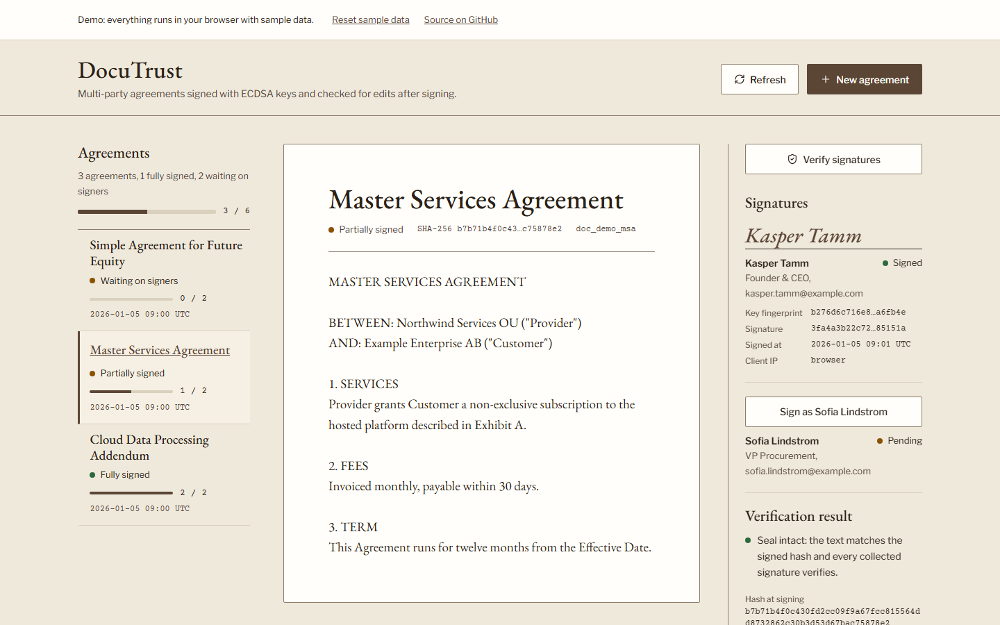

# DocuTrust

DocuTrust is a multi-party agreement signer. Each signer signs a SHA-256 hash of the agreement's title and text with an ECDSA P-256 key, and the app re-computes that hash on demand to show whether the stored text still matches what was signed. It has an Express API with SQLite storage and a React dashboard for creating agreements, signing them, verifying them and testing what an after-the-fact edit looks like.

[](https://github.com/Taan1el/docutrust/actions/workflows/ci.yml)
[](https://github.com/Taan1el/docutrust/actions/workflows/pages.yml)
[](LICENSE)

**Live demo:** https://taan1el.github.io/docutrust/

The demo runs entirely in your browser. The same canonical hashing and validation code the server uses runs against Web Crypto and a localStorage-backed store, so it needs no backend. Sample agreements are the same on every reset.

## Screenshots



More screenshots: [the full page with the tamper tester and audit trail under the sheet](docs/screenshots/02-agreement.png), [a broken-seal result after an edit without re-signing](docs/screenshots/03-tamper.png), [the dashboard at phone width](docs/screenshots/04-mobile.png).

## What it is for

Teams that need several people to approve a document and want a record of who signed which exact text. Anyone who needs to see how hash-and-sign tamper detection behaves can edit a signed agreement in the tamper tester and watch every signature fail.

## Features

- Create an agreement with a title, text and one or more signers (name, email, role).
- Sign as each pending signer. Every signature uses a fresh ECDSA P-256 key pair; the private key is used once and not stored.
- Verify an agreement at any time. Verification re-hashes the current title and text and checks each stored signature against that hash.
- Tamper tester: writes a new title or text straight into storage without re-signing, then re-verifies.
- Audit trail of creation, signing, verification and tamper events, with truncated hashes and the full value on hover.
- The open agreement reads as a sheet on a desk: a slim agreements list on the left, signature blocks and the verification result in a margin column on the right, with key fingerprints and signature values in monospace.
- Static demo build for GitHub Pages with sample data and a reset control.

## Getting started

### Prerequisites

- Node.js 22.5 or newer (the server uses the built-in `node:sqlite` module). Docker is optional.

### Install

```bash
git clone https://github.com/Taan1el/docutrust.git
cd docutrust
npm install
```

### Run

```bash
npm run dev
```

The API listens on http://127.0.0.1:4000 and the Vite dev server on http://localhost:5173, which proxies `/api` to the API. The first start seeds three sample agreements into an empty database.

For a production-style run: `npm run build`, then `npm start --workspace=server`. The server also serves the built client from `client/dist`.

### Environment variables

Server (see `server/.env.example`; nothing loads the file automatically, so export the values or use `node --env-file`):

| Variable | Default | Purpose |
|---|---|---|
| `PORT` | `4000` | Port the API listens on |
| `HOST` | `127.0.0.1` | Interface to bind. The API has no authentication, so it stays on loopback unless changed |
| `DOCUTRUST_DB_PATH` | `server/data/docutrust.db` | SQLite file location |

Client (see `client/.env.example`):

| Variable | Default | Purpose |
|---|---|---|
| `VITE_API_TARGET` | `http://127.0.0.1:4000` | Where the Vite dev server proxies `/api` |

## Scripts

| Script | What it does |
|---|---|
| `npm run dev` | API with file watching plus the Vite dev server |
| `npm run build` | Compile the server and build the client into `client/dist` |
| `npm run build:pages` | Build the static demo into `client/dist-pages`, with base path `/docutrust/` |
| `npm run lint` | Type-check server and client |
| `npm test` | Run server and client tests |

## How it works

1. **Canonical text.** `shared/canonical.ts` normalizes line endings to `\n`, trims the title and text, and JSON-encodes the pair `{title, content}`. Encoding both fields means a changed title is caught like a changed clause, and `("AB","C")` cannot collide with `("A","BC")`.
2. **Hash.** The document hash is SHA-256 of that string, stored as 64 hex characters when the agreement is created.
3. **Signature.** To sign, the server (or the browser in the demo) generates an ECDSA P-256 key pair and signs the hex hash string with SHA-256. It stores the signature, the public key (PEM), a key fingerprint (first 32 hex characters of the SHA-256 of the public key's DER bytes), the time and the requester's address and user agent. The crypto service can also sign and verify RSA-PSS keys passed through the API; the dashboard never uses them.
4. **Verification.** `GET /api/documents/:id/verify` re-hashes the stored title and text. If the hash differs from the stored one, the document is reported as tampered and every signature fails. Otherwise each signature is checked against the stored hash with that signer's public key.

What this covers: a change to the stored title or text after signing is detected, as long as the stored hash and signatures were not rewritten along with it. What it does not cover: the app does not verify who a signer is. Anyone who can call the sign endpoint for a pending signer produces a valid signature, and the private key is generated by the server for that request. Someone with write access to the database can replace the text, hash, public keys and signatures together and the result would verify. The audit trail and the recorded client address are plain database rows, and the address comes from the `x-forwarded-for` header when present, so it can be spoofed. This is a demonstration of the mechanism, not an electronic-signature service, and it makes no claim of legal validity.

### Project layout

```
client/            React dashboard (Vite)
  src/components/    agreements list, sheet view, tamper tester and result, dialogs
  src/services/      API client, demo adapter, Web Crypto helpers
  src/styles/        design tokens
shared/            Code used by both server and demo: canonical text, validation, errors, types
server/
  src/               Express app, routes, controllers, signing and crypto services, SQLite repository
  test/              API, crypto and validation tests
docs/adr/          Decision records
docs/screenshots/  README images
```

## API reference

All responses are `{ "success": boolean, "data"?: ..., "error"?: string }`.

| Method | Path | Purpose |
|---|---|---|
| GET | `/api/health` | Service status |
| GET | `/api/documents` | List agreements with signers |
| POST | `/api/documents` | Create an agreement. Body: `title`, `content`, `signers[]` |
| GET | `/api/documents/:id` | One agreement with its audit trail |
| POST | `/api/documents/:id/sign` | Sign as a signer. Body: `signerId` |
| GET | `/api/documents/:id/verify` | Re-hash and verify every signature |
| POST | `/api/documents/:id/tamper` | Overwrite title and/or text without re-signing. Body: `tamperedTitle`, `tamperedContent` |
| GET | `/api/crypto/keypair` | Generate a key pair (`?algorithm=` ECDSA_P256_SHA256 or RSA_PSS_SHA256) |

Invalid input returns 400, unknown ids 404, a repeated signature 409, and non-JSON bodies 415. Unexpected errors return a generic 500 message without internal detail.

`/api/documents/:id/tamper` and `/api/crypto/keypair` return key material and rewrite data, and the API has no authentication. Keep it on loopback or behind your own access control.

## Testing

```bash
npm test
```

Server tests (Vitest and Supertest) cover key generation, canonical hashing, sign and verify for both key types, the full create, sign and verify flow, tamper detection on title and text, validation limits and error responses, all against an in-memory database. Client tests (React Testing Library) cover the agreements list, create and sign dialogs, the tamper tester and the verification result, plus the demo data layer and Web Crypto helpers. No test uses real timers or sleeps.

## Deployment

### Docker

```bash
docker compose up --build
```

The image builds both workspaces, runs as the unprivileged `node` user and serves the API and the built client on port 4000. The compose file publishes the port on 127.0.0.1 only and keeps the SQLite file in a named volume.

### GitHub Pages

`.github/workflows/pages.yml` builds the demo with `npm run build:pages` on every push to `main` and deploys it when the repository is public.

## Design notes and limitations

- SQLite through `node:sqlite` in WAL mode keeps the server dependency-free apart from Express. The module needs Node 22.5 or newer.
- The demo signs with Web Crypto, which encodes ECDSA signatures as raw r and s values rather than the DER form Node produces. Demo data and server data are not interchangeable.
- Demo agreements live in localStorage for one browser. Private browsing falls back to memory for the page view.
- One database, no accounts, no authentication, no email delivery to signers.
- No performance measurements have been taken, so none are claimed.

## Roadmap

- Signer authentication so a signature can only be made by the invited person.
- Client-side key generation so the server never holds a private key.
- Signature timestamps from an external time source.
- Export of an agreement with its signatures and public keys for verification outside the app.

## License

MIT. See [LICENSE](LICENSE).
